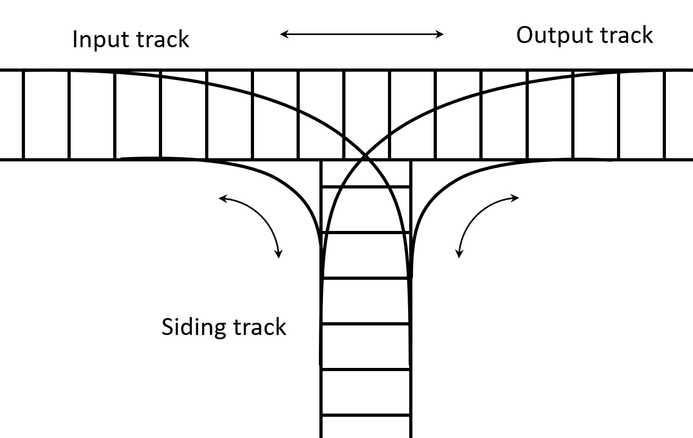

# Train arrangement using stacks

For this assignment you are to write a program that arranges cars on a train based on a given desired ordering.
Consider the following diagram of a train track.



Cars come in from the left and exit on the right hand side.
They can also move onto the “siding” track to the bottom.
At the intersection,
each car on the input train can either move to the exit track or onto the siding.
From the siding,
each car can either move to the exit track or back onto the input track.
And finally,
from the exit track,
a car can move back to the input or siding tracks.
The input,
output,
and siding tracks are stacks,
since you can only access the car at the head of the track (as viewed from the intersection point).
All tracks are at least as long as the input train.

Given an input sequence of cars and a desired ordering,
your program should arrange the cars of the train so that the exit track is in order.
To do this,
the following classes already exist:

```{java}
public class Car implements Comparable<Car> {
    String toString();            // String representation
    int compareTo(Car other);     // compares two cars
    boolean equals(Object other); // compares cars for equality
}
```

```{java}
public enum Track {
    INPUT,
    OUTPUT,
    SIDING;
}
```

```{java}
public class TrainYard {
    public TrainYard(int [] cars);          // build a train from the int array of cars
    public Car frontOf(Track track);        // peek at the front of a track, returns null if empty
    public void move(Track from, Track to); // move the front car from one track to another
    public String toString();               // String representation of the current train yard
    public boolean containsCar(Track track, Car car); // checks if this car is on the track
}
```

The following code demonstrates how you might use the `TrainYard` to move all the input cars directly to the output track:

```{java}
public class RunMe {
    public static void main(String [] args) {
        int [] cars = {1, 2, 3, 4, 5};
        TrainYard yard = new TrainYard(cars);
        
        System.out.println(yard);
        while (yard.frontOf(Track.INPUT) != null) {
            yard.move(Track.INPUT, Track.OUTPUT);
        }
        System.out.println(yard);
    }
}
```

This would yield the following output:

```
 INPUT: [Car #1, Car #2, Car #3, Car #4, Car #5]
OUTPUT: []
SIDING: []

 INPUT: []
OUTPUT: [Car #5, Car #4, Car #3, Car #2, Car #1]
SIDING: []
Moves so far:
   1. Move Car #5 from Input to Output
   2. Move Car #4 from Input to Output
   3. Move Car #3 from Input to Output
   4. Move Car #2 from Input to Output
   5. Move Car #1 from Input to Output
```

Printing out the yard will show both the current state of the tracks and the moves that got you there.

Here is an example set of input:

```
Desired ordering:
[Car #20, Car #7, Car #6, Car #10, Car #14, Car #20, Car #18, Car #12, Car #2, Car #10]

Starting yard:
INPUT: [Car #2, Car #6, Car #20, Car #7, Car #18, Car #10, Car #14, Car #20, Car #12, Car #10]
OUTPUT: []
SIDING: []

Final yard with moves:
  INPUT: []
OUTPUT: [Car #20, Car #7, Car #6, Car #10, Car #14, Car #20, Car #18, Car #12, Car #2, Car #10]
SIDING: []
Moves so far:
   1. Move Car #10 from Input to Siding
   2. Move Car #12 from Input to Siding
   3. Move Car #20 from Input to Output
   4. Move Car #14 from Input to Siding
   5. Move Car #10 from Input to Siding
   6. Move Car #18 from Input to Siding
   7. Move Car #7 from Input to Output
   8. Move Car #20 from Input to Siding
   9. Move Car #6 from Input to Output
  10. Move Car #20 from Siding to Input
  11. Move Car #18 from Siding to Input
  12. Move Car #10 from Siding to Output
  13. Move Car #14 from Siding to Output
  14. Move Car #18 from Input to Siding
  15. Move Car #20 from Input to Output
  16. Move Car #18 from Siding to Output
  17. Move Car #12 from Siding to Output
  18. Move Car #2 from Input to Output
  19. Move Car #10 from Siding to Output
```

If you are having trouble visualizing an algorithm,
cut out some pieces of paper and arrange them on your desk as the picture above shows.
Label each with a car number.
Manually shift the "cars" around according to the rules of top-of-stack access only to study each approach.
