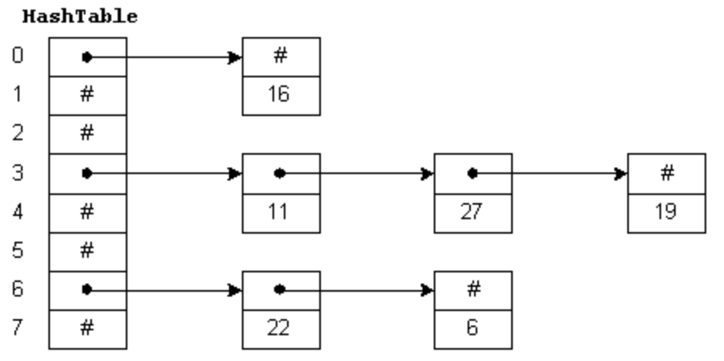

# Homework 2 Quiz & Prompt

## Quiz

### Question 1

Consider inserting the keys 71, 23, 73, 99, 44, 79, 89 into a hash table of size N = 10.
Show the result of hashing using separate chaining if the hash function is h(x) = x mod 10.

**Explainer:**

Enter only buckets containing a value,
with the bucket index followed by a colon,
and then a list of values in that bucket,
separated by spaces.
For example,
the hash table below would be entered as:

0:16

3:11 27 19

6:22 6

#### Answer

TODO

### Question 2

Now show the results of hashing the same values (71, 23, 73, 99, 44, 79, 89) using linear probing.

#### Answer

TODO

### Question 3

Now show the results of hashing the same values (71, 23, 73, 99, 44, 79, 89) using separate chaining and a hash function of h(x) = x mod 5.
Note that the table will still have ten buckets.

#### Answer

TODO

### Question 4

Now show the results of hashing the same values (71, 23, 73, 99, 44, 79, 89) using linear probing and a hash function of h(x) = x mod 5.
Note that the table will still have ten buckets.

#### Answer

## Prompt

In two to three paragraphs of prose (i.e. sentences, not bullet lists) using APA style citations if needed, summarize and interact with the content that was covered in the class session this week. In your summary, you should highlight the major topics, theories, practices, and knowledge that were covered. Your summary should also interact with the material through personal observations, reflections, and applications to the field of study. In particular, highlight what surprised, enlightened, or otherwise engaged you. Make sure to include at least one thing that you’re still confused about. In other words, you should think and write critically not just about what was presented but also what you have learned through the session. You must ask at least one question. If you don't have questions about the material, ask me anything related to computer science, the industry, etc.

### Response

TODO
