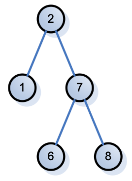

# Homework 4 Quiz & Prompt

## Quiz

For the next set of problems,
insert the given values into a binary search tree.
For each insert,
list the parent of the new value and which child it is (L or R).
For example when one was inserted into the tree below,
that insert would have been described as:

### Question 1

Starting with a tree containing only the value 15, insert the value 7.

> 15 L

### Question 2

Now insert 20.

> 15 R

### Question 3

Now insert 17.

> 20 L

### Question 4

Now insert 11.

> 7 R

### Question 5

Now insert 10.

> 11 L

## Prompt

In two to three paragraphs of prose (i.e. sentences, not bullet lists) using APA style citations if needed, summarize and interact with the content that was covered in the class session this week. In your summary, you should highlight the major topics, theories, practices, and knowledge that were covered. Your summary should also interact with the material through personal observations, reflections, and applications to the field of study. In particular, highlight what surprised, enlightened, or otherwise engaged you. Make sure to include at least one thing that you’re still confused about. In other words, you should think and write critically not just about what was presented but also what you have learned through the session. You must ask at least one question. If you don't have questions about the material, ask me anything related to computer science, the industry, etc.

> This week's focus was on the tree data structure and the recursive nature of implementing algorithms with trees. Additionally, we learned another design pattern called "Singleton". The main focus for the tree data structure was on binary trees and the special case that makes one a search tree. With these structures we learned about the different ways to traverse a tree, even practicing a different way in the homework where we list the nodes at each depth instead of pre-order, in-order, or post-order. Binary search trees vastly reduce the search time complexity over ArrayList and LinkedList with O(log n) due to the construction requirement that values less than a node go to the left and greater than (or equal to) goes to the right. I felt comfortable with the topics this week, even the Singleton design pattern as its one I've consciously used in my professional coding before.
How often do you reach for the binary (search) tree in your professional work? If I'm correct, it seems like you focus on "backend" development projects so I imagine the tradeoffs between the data structures comes up more for you than it might in application/UI development.
